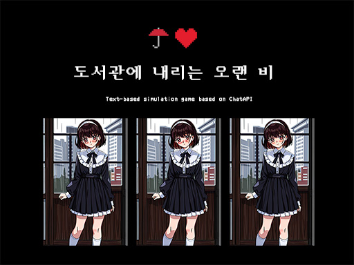

# ☔️❤️ 도서관에 내리는 오랜 비 (Project Rainly Girl)



ChatGPT 기반의 텍스트 시뮬레이션. 그칠줄 모르는 장마가 지속되는 여름날. 당신은 학교 도서관에서 한 소녀를 만납니다.
소녀와 이야기하며 소녀에게 호감을 얻어보세요. 호감도가 높아지면 당신은 소녀에게 귀중한 선물을 받게될지도 모릅니다.
엔딩은 당신의 대화에 따라 결정됩니다.

_Embark on a captivating journey in this text-based simulation game based on ChatGPT. Immerse yourself in an endless rainy summer as you stumble upon a mysterious girl at the school library. Engage in heartfelt conversations and navigate the complexities of human connection to earn her affection. With each interaction, your bond deepens, unlocking the possibility of receiving precious gifts. The outcome of this enchanting tale rests solely on the choices you make during these impactful dialogues. Are you ready to shape your own destiny in this immersive narrative experience?_

## [🎮 Web Demo](https://ji1kang.github.io/project-rainly-girl/)

⚠️ 플레이를 위해서는 **OpenAPI Key가 필요**하며, 한회차 플레이시 $0.3 정도가 부과됩니다 (여유로운 추정치)

---

## 📦 Assets

- Frontend Template: [ChatGPT clone with DALL.E image generation model by Eyuel](https://github.com/EyuCoder/chatgpt-clone)
- Font: [DOSGothic (도스고딕) by hurss](https://github.com/hurss/fonts)
- Image: AI Generated Images with [SeaArt](https://www.seaart.ai)
  - 소녀의 이미지: [[초기 프롬프트]](https://www.seaart.ai/explore/detail/cid89ah4msbfb6vhjttg), [[최종 버전 프롬프트]](https://www.seaart.ai/explore/detail/cid8jsp4msbfb6vi6770)
  - 연출 이미지(⚠️스포일러 주의⚠️): [[엔딩1 프롬프트]](https://www.seaart.ai/explore/detail/cih6voh4msb7pi9oi7ng), [[엔딩2 프롬프트 - 초기 버전]](https://www.seaart.ai/explore/detail/cihdarp4msb49osk4mbg), [[엔딩2 프롬프트 - 초기 버전에서 후가공]](https://www.seaart.ai/explore/detail/cihde3p4msb49oska22g)
- Icon: [Icon8](https://icons8.com/icons/set/pixel)

---

## 💻 프로젝트 커스텀

- 해당 프로젝트를 활용해 커스텀할 수 있습니다

> This project is released under the Apache License 2.0 license. See [LICENSE](./LICENSE) for details.

### 시작하기

```bash
git clone https://github.com/ji1kang/project-rainly-girl.git
cd project-rainly-girl
npm i
npm start
```

### 배포하기

- 참고: [깃허브 페이지로 배포하기](https://whales.tistory.com/104)

```bash
npm run deploy
```

**_주요 프로젝트 구조_**

- `components/ChatView.js`: 프로젝트 메인 페이지, 게임 진행을 위한 대화 및 이벤트 관리
- `assets/prompt.js` & `utils/davinci.js`: OpenAI API와 langchain.js을 사용하여 대화 및 요약 모델을 실행
- `assets/script.js`: 게임 상태 및 기본 문구 설정
- `components/SideBar.js`: 사이드바 관리
- `context/chatContext.js` & `hooks/useMessageCollection.js`: 게임 진행을 위한 대화 히스토리 저장 및 관리

**_Tech used_**

- openAI API
- react
- tailwindcss
- react-icons
- langchain.js

---

## 개발 진행시 참고자료

- [프롬프트 테스트 (openAI)](https://platform.openai.com/playground)
- [LangChain.js](https://js.langchain.com/docs)
- [Awesome AI Tools for Game Developers](https://github.com/simoninithomas/awesome-ai-tools-for-game-dev)

---

🤗 대화로그는 드래그해서 복사가 가능합니다. Pull Request로 언제든지 대화로그와 감상을 남겨주시면 환영이에요!
